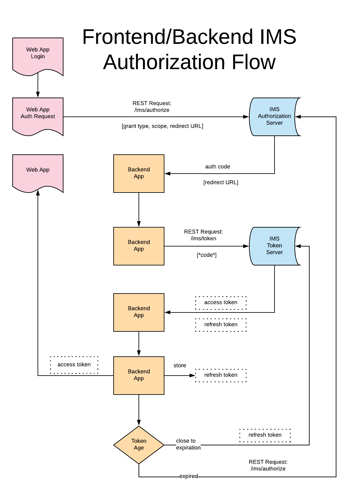

# OAuth Integration

Registered partner applications are entitled to access Lightroom customer content with a user _access token_ generated through a standard OAuth workflow provided by the Adobe Identity Management System (IMS).

**Note: _Following best security practices, user access tokens or refresh tokens must  be stored in any backend service in a secure format with encryption at rest._**

The OAuth workflow is described in detail in the [Adobe IMS Authentication and Authorization](https://www.adobe.io/authentication/auth-methods.html#!AdobeDocs/adobeio-auth/master/OAuth/OAuth.md) documentation. It requires an API key and client secret obtained by [Creating an Integration](/create_integration).

Partner applications must include the `lr_partner_apis` scope (along with the standard `openid` and `AdobeID` scopes) to access the Lightroom Services.

To allow renew of refresh token, additional setup is needed on the API key. Should your application require this capability, you must contact Adobe and describe your needs. 

## Authentication Sample Code

Adobe I/O provides two [OAuth samples](https://github.com/AdobeDocs/adobeio-auth/blob/master/OAuth/samples/samples.md) on GitHub for the authentication workflow, one in Node.js and one in Python.

- To run the [Node.js sample](https://github.com/AdobeDocs/adobeio-auth/blob/master/OAuth/samples/adobe-auth-node), replace the `creative_sdk` scope in _server/index.js_ with `lr_partner_apis` and follow the instructions in the ReadMe to run the application.

- To run the [Python example](https://github.com/AdobeDocs/adobeio-auth/blob/master/OAuth/samples/adobe-auth-python), replace the `creative_sdk` scope in _adobe-oauth2.0.py_ with `lr_partner_apis` and follow the instructions in the ReadMe to run the application.

Authorization through the Adobe Identify Management System is working as expected if a user is able to successfully log in and view their profile information.

## Authorization Workflow Diagrams

