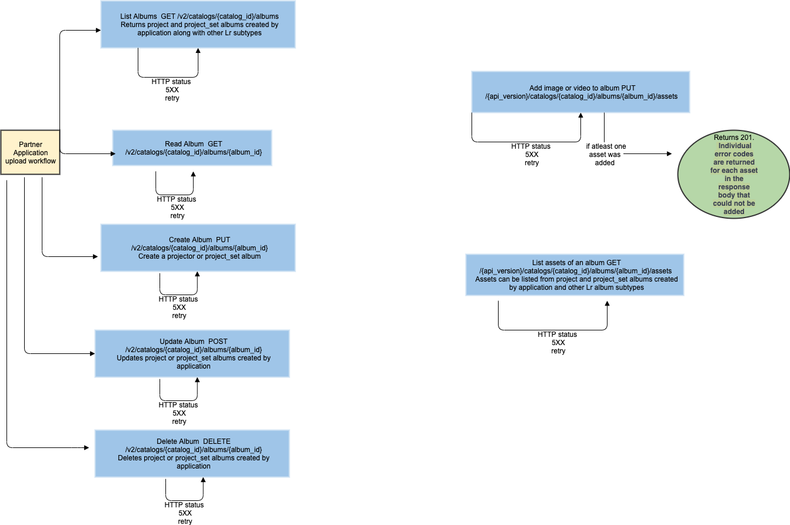

# Manage Content

There are two workflows with which a partner application can manage content:
* Affiliating Content
* Uploading to Lightroom and Managing Content

## Affiliating Content

A partner application can affiliate content in Lightroom with content in its own asset management system, and publish content from Lightroom.

## Uploading to Lightroom and Managing Content

_Note: When a [new asset is created and uploaded](../upload_content/) to a Lightroom catalog, partner applications should always set the `importedOnDevice` field to their API key. This will ensure that the asset is properly tagged in Lightroom as having originated from the partner application. They should also retain the unique identifier of the asset (`asset_id`) and catalog (`catalog_id`) for use in the workflows detailed below._

Partner applications that upload new assets to the catalog of a Lightroom customer may want a way to identify those assets, both inside the Lightroom clients as well as in applications on their own services.

Assets can be grouped together in a catalog through a special album of subtype _project_. Partner applications can create one or more project albums and add uploaded assets to them. Lightroom clients will display project albums of recognized partner applications in their _Connections_ panel, enabling Lightroom customers to further manage the content directly in Lightroom.

### Creating a Project Album

As with the `asset_id` of new assets, partner applications should generate a globally unique identifier for a new project album (`album_id`), conforming to RFC-4122 without hypens. They can then create a new project album with this and the `catalog_id`:

```
PUT /v2/catalogs/{catalog_id}/albums/{album_id}
```

With a body of the form:

```
{
    "subtype": "project",
    "serviceId": "<partner API key>",
    "payload": {
        "userCreated": "2012-01-03T04:54:15Z",
        "userUpdated": "2012-01-03T04:54:15Z",
        "name": "Crivitz",
        "publishInfo": {
            "version": 3,
            "created": "2017-08-03T04:54:32.884643Z",
            "updated": "2017-08-03T04:54:32.884643Z",
            "deleted": true,
            "remoteId": "seRviC3-sp3c1fic",
            "remoteLinks": {
                "edit": {
                    "href": "https://external.site.com/editor/albums/afd05f03"
                },
                "view": {
                    "href": "https://external.site.com/albums/afd05f03"
                }
            },
            "servicePayload": "service-specific string"
        }
    }
}
```

See the [generic data model page](../guides/common_data_model/) for descriptions of common fields. At the top level of the object is a `serviceId` that must be set to the API key of the partner application. The `payload.name` field holds a user-visible string that will be shown in Lightroom clients when they present the project album.

The `publishInfo` clause is the place for partner applications to persist information in the Lightroom catalog regarding external content that is affiliated with the project album. Its fields are:

- `version` (required, integer) Should be 3 for new projects.
- `created` (optional, ISO 8601 date) Date when any externally affiliated content on the partner service was initially created.
- `updated` (optional, ISO 8601 date) Date when any externally affiliated content on the partner service was updated or deleted. Must match the created field when that field is first set.
- `deleted` (optional, boolean) Whether the externally affiliated content has been deleted from the partner service, thereby acting as a tombstone.
- `remoteId` (optional, string) Identifier for the externally affiliated content that is unique to the partner service.
- `remoteLinks` (optional, table): Links to affiliated URLs on the partner service.
    - `edit` (optional, table): Table whose "href" entry is an absolute URL to edit the externally affiliated content on the partner service
    - `view` (optional, table): Table whose "href" entry is an absolute URL to view the externally affiliated content on the partner service
- `servicePayload` (optional, string) Metadata that is unique to the partner service, encapsulated as a single string with a maximum length of 1024 characters.

### Enumerating Project Albums

Partner applications can enumerate project albums with:

```
GET /v2/catalogs/{catalog_id}/albums?subtype=project
```

It will return an array of project albums in `resources`. If there are no project albums affiliated with the partner application, then the array will be empty.

```
{
    "base": "https://lr.adobe.io/v2/catalogs/9479135e/",
    "resources": [
        {
            "id": "a3c679e3",
            "created": "2012-01-03T04:54:32.884643Z",
            "updated": "2012-01-03T04:54:32.884643Z",
            "type": "album",
            "subtype": "project",
            "serviceId": "<partner API key>",
            "payload": {
                "userCreated": "2012-01-03T04:54:15Z",
                "userUpdated": "2012-01-03T04:54:15Z",
                "name": "Crivitz",
                "publishInfo": {
                    "version": 3,
                    "created": "2017-08-03T04:54:32.884643Z",
                    "updated": "2017-08-03T04:54:32.884643Z",
                    "remoteId": "seRviC3-sp3c1fic",
                    "remoteLinks": {
                        "edit": {
                            "href": "https://external.site.com/editor/albums/afd05f03"
                        },
                        "view": {
                            "href": "https://external.site.com/albums/afd05f03"
                        }
                    },
                    "servicePayload": "service-specific string"
                }
            },
            "links": {
                ....
            }
        },
        ...
    ]
}
```

### Adding Assets to a Project Album

To add one or more assets to a project album with an ID `album_id` in a catalog with an ID `catalog_id` (up to 50 assets per call), use the API:

```
PUT /v2/catalogs/{catalog_id}/albums/{album_id}/assets
```

with a body of the form:

```
{
    "resources": [
        {
            "id": "<asset_id_0>",
            "payload": {
                "cover": true,
                "order": "string",
                "publishInfo": {
                    "remoteId": "seRviC3-sp3c1fic",
                    "servicePayload": "service-specific string"
                }
            }
        },
        ...
    ]
}
```

This will generate a new _album asset_ with the given metadata for each asset in the list. A single asset may be placed in multiple albums in a Lightroom catalog, and the album asset metadata provides a mechanism to attach information to the asset that is unique to each album in which it appears.

The `publishInfo` clause is the place for partner applications to persist information in the Lightroom catalog regarding external content that is affiliated with each asset being added to the project album. Its fields are:

- `remoteId` (optional, string) Identifier for the externally affiliated content that is unique to the partner service.
- `servicePayload` (optional, string) Metadata that is unique to the partner service, encapsulated as a single string with a maximum length of 1024 characters.

Setting the optional `cover` to be `true` will inform Lightroom clients and partner applications that any visual representation of the project album should use that asset as its thumbnail. Only one asset can be the cover. If the project album does not have a cover asset, clients are expected to use the first asset in the album as the cover.

#### Custom Order

The optional `order` field supports custom ordering of assets in the project album. The order string shall contain a maximum of 1024 characters in the set: [-0-9A-Z_a-z]. This is the same character set as `base64url` described in RFC 4648 and was chosen for its URL-safeness. It differs from base64url due to the lexicographical sort order: (“-”, “0”, “9”, “A”, “Z”, “_”, “a”, “z”).

This charset and sort order shall be called _lex64_. The following should be taken into consideration:

- The absence of an order field will cause that object to be sorted at the end for an ascending sort, or at the beginning for a descending sort.
- The secondary sort field will be the captureDate date of the object (for identical or absent values).
- The tertiary sort field will be the created date of the object (for identical or absent captureDate values).
- The empty string is not a valid order field value.
- In order to preserve the ability to insert at the beginning of the list, the order string cannot end with the “-” character.

### Connect Workflow diagrams
