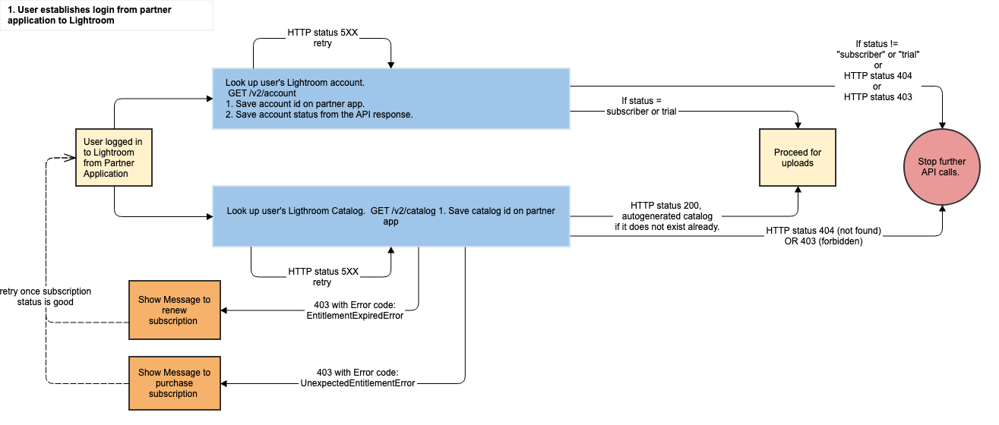
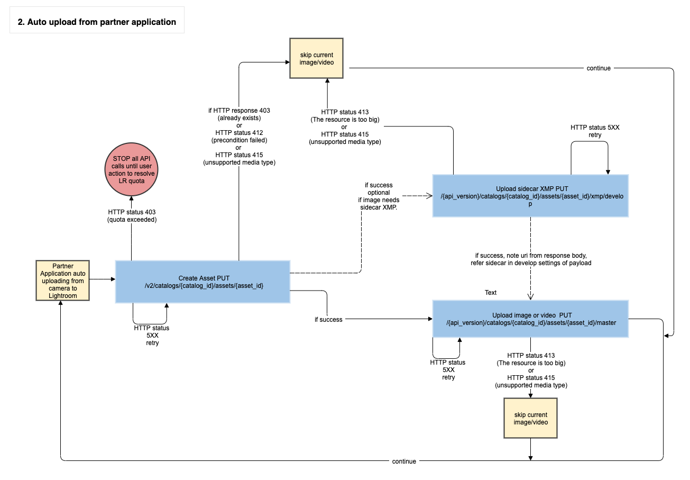
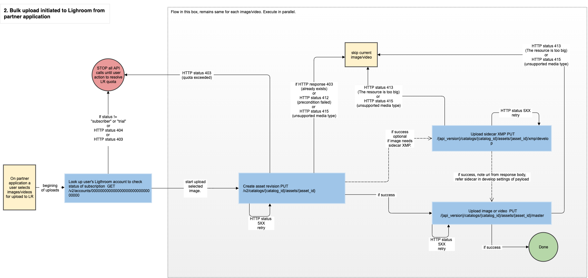

# Upload Customer Images and Videos

The upload workflow should be attempted only for users who already have a Lightroom account with an active subscription and an existing catalog with enough storage space to accommodate the incoming assets. A detailed list of precondition checks is provided later in this document. Use the base endpoint https://lr.adobe.io for all APIs.

## Health Check

At any time, the health of the Lightroom service may be queried with:

```
GET /v2/health HTTP/1.1
```

Expected success response:

```
HTTP/1.1 200 OK
Content-Type: application/json
Content-Length: {xsd:nonNegativeInteger}
{
    "version": "<product_version>"
}
```

## Check Customer Entitlement

Applications should fetch the customer account information and inspect the `entitlement.status` field to determine the Creative Cloud entitlement of the customer. If this value is not either `subscriber` or `trial`, then any other calls to the Lightroom services will return a `403 Forbidden` error.

```
GET /v2/account HTTP/1.1
Authorization: {auth_token}
Content-Type: application/json
Content-Length: {xsd:nonNegativeInteger}
```

Sample success response:

```
HTTP/1.1 200 OK
Content-Type: application/json
Content-Length: {xsd:nonNegativeInteger}
{
    "base": "<base_url>/",
    "id": "<account_id>",
    "type": "account",
    "links": {
        "self": {
            "href": "/v2/accounts/<account_id>"
        },
        "/rels/apps": {
            "href": "<account_apps_link>"
        },
        "/rels/avatars/small": {
            "href": "/v2/avatars/<account_id>/<timestamp>/small",
            "size": 50
        },
        "/rels/avatars/small2x": {
            "href": "/v2/avatars/<account_id>/<timestamp>/small2x",
            "size": 100
        },
        "/rels/avatars/medium": {
            "href": "/v2/avatars/<account_id>/<timestamp>/medium",
            "size": 115
        },
        "/rels/avatars/medium2x": {
            "href": "/v2/avatars/<account_id>/<timestamp>/medium2x",
            "size": 230
        },
        "/rels/avatars/large": {
            "href": "/v2/avatars/<account_id>/<timestamp>/large",
            "size": 138
        },
        "/rels/avatars/large2x": {
            "href": "/v2/avatars/<account_id>/<timestamp>/large2x",
            "size": 276
        }
    },
    "email": "<email_address>",
    "full_name": "<full_name>",
    "first_name": "<first_name>",
    "last_name": "<last_name>",
    "avatar": {
        "placeholder": {boolean}
    },
    "created": "<created_date>",
    "updated": "<updated_date>",
    "wcd_guid": "<wcd_guid>",
    "country": "<country_id>",
    "entitlement": {
        "status": "<account_status>",
        "trial": {
            "start": "<trial_start_date>",
            "end": "<trial_end_date>"
        },
        "current_subs": {
            "product_id": "<subscription_product_id>",
            "store": "<subscription_store>",
            "purchase_date": "<subscription_purchase_date>",
            "sao": {
                "inpkg_LRMP": "1"
            }
        },
        "storage": {
            "used": <upload_usage_count>,
            "limit": <storage_limit>,
            "display_limit": <storage_display_limit>,
            "warn": <storage_warn_limit>
        },
        "deletion_date": "<deletion_date>"
    },
    "payload": {
        "lightroom": {
            "<settings_key>": "<settings_value>"
        }
    },
    "config": {
        "<config_key>": "<config_value>"
    }
}
```

## Check Customer Catalog

If a Lightroom customer is entitled, an application should fetch the user catalog. 

If a user has a catalog, the application should obtain the catalog identifier for use in the upload APIs. Otherwise, an application can inform users that they must first log into an Adobe Lightroom client before they are able to upload content from the partner application.

```
GET /v2/catalog HTTP/1.1 
Authorization: {auth_token}
Content-Type: application/json
Content-Length: {xsd:nonNegativeInteger}
```

Sample success response:

```
HTTP/1.1 200 OK
Content-Type: application/json
Content-Length: {xsd:nonNegativeInteger}
{
    "base": "<base_url>",
    "id": "<catalog_id>",
    "type": "catalog",
    "subtype": "<catalog_subtype>",
    "created": "<created_date>",
    "updated": "<updated_date>",
    "links": {
        "self": {
            "href": "catalogs/<catalog_id>"
        },
        "/rels/collections": {
            "href": "catalogs/<catalog_id>/albums?subtype=collection"
        },
        "/rels/images_videos": {
            "href": "catalogs/<catalog_id>/assets?subtype=image%3Bvideo"
        },
        "/rels/deleted_images_videos": {
            "href": "catalogs/<catalog_id>/assets?subtype=deleted_image%3Bdeleted_video&purge_date_after=0000-00-00T00:00:00"
        },
        "/rels/catalog_spaces": {
            "href": "catalogs/<catalog_id>/spaces?subtype=shared"
        },
        "/rels/updates": {
            "href": "catalogs/<catalog_id>/updates"
        },
        "/rels/tasks/index": {
            "href": "<index_task_link>"
        },
        "/rels/tasks/tag": {
            "href": "<tag_task_link>"
        }
    },
    "payload": {
        "name": "<catalog_name>",
        "<key>": "<value>"
    }
}
```

## Upload an Image or Video to the Catalog

At this point, a client application should have a catalog identifier (`catalog_id`), which is required for the remainder of the workflow. 

_STEP 1_: Create an asset by providing newly generated globally unique identifiers (GUID) for `asset_id`. Refer to RFC-4122 for a description of GUIDs. The Lightroom services accept only GUIDs without hyphens. Most languages provide libraries to generate GUID (For examples refer https://docs.oracle.com/javase/7/docs/api/java/util/UUID.html and https://docs.python.org/3/library/uuid.html)

```
PUT /v2/catalogs/{catalog_id}/assets/{asset_id} HTTP/1.1 
Authorization: {auth_token}
Content-Type: application/json
Content-Length: {xsd:nonNegativeInteger}
If-None-Match: {xsd:string}
{
	"subtype": "{asset_subtype}",
	"payload": {
		"captureDate": "0000-00-00T00:00:00",
		"importSource": {
			"fileName": "{file_name}",
			"importedOnDevice": "{import_device_name}",
			"importedBy": "{import_account_id}",
			"importTimestamp": "{import_time}"
		}
	}
}
```

Sample success response:

```
HTTP/1.1 201 
CreatedContent-Length: 0
Location: {xsd:anyURI}
```

_STEP 2_: Upload the image or video file binary data. This API allows a maximum of 200MB to be uploaded per invocation. Larger files must be uploaded in chunks with this API by including `Content-Range` headers for each part. Clients may make multiple requests with `Content-Range` headers in parallel. For better fault tolerance, it may be preferable for clients to upload chunks smaller than 200MB.

```
PUT /v2/catalogs/{catalog_id}/assets/{asset_id}/master HTTP/1.1
Authorization: {auth_token}
Content-Length: {xsd:nonNegativeInteger}
Content-Range: {xsd:string}
Content-Type: {xsd:string}
```

Sample success response:

```
HTTP/1.1 201 
CreatedContent-Length: 0
Location: {xsd:anyURI}
```

NOTE: Refer to the API documentation for further information about above listed APIs.

## Precondition Checks Before Upload

Partner applications should check that an upload to a Lightroom customer catalog will succeed, and provide appropriate feedback to the user in cases where it will not. If a customer has logged in through Adobe IMS, the call to get the Lightroom account information will return a full response, barring network or service interruptions.
```
GET /v2/account
```

- _User is entitled to Lightroom_: The account `entitlement.status` must be `subscriber` or `trial`. Other values indicate that a customer may be entitled to a different Adobe product; may have an expired subscription; or may never have subscribed to any product.

- _User has not exceeded their Lightroom storage_. If the account `entitlement.storage.used` is greater than or equal to the `entitlement.storage.limit` then the customer has exceeded their storage quota.

- _User has sufficient space for the upload_. Client applications should calculate the size of the images to be uploaded and determine they will fit in the available storage (`entitlement.storage.limit` - `entitlement.storage.used`).

- _User has a Lightroom catalog_: Entitled Lightroom customers may either have an existing lightroom catalog generated via Lightroom client applications or a new catalog will be generated when the partner application looks up the user's catalog using the below API:
  ```
  GET /v2/catalog
  ```
  This call will fail with a `403` if the user has no catalog and a new catalog cannot be generated; otherwise it will return the catalog information.

## General Error Conditions

The Lightroom APIs may return these errors that a shared among all of the entry points:

- _Invalid API Key_: Calling an API results in an `HTTP 403` error of the form:
  ```
  {
      "error_code": "403003",
      "message": "Api Key is invalid"
  }
  ```
  The partner application should include their API key in the `X-API-Key` header

- _Access token expired_: Calling an API results in an `HTTP 403` error of the form:
  ```
  {
      "error_code": "4300",
      "message": "Access is forbidden"
  }
  ```
  The partner application should obtain a new access token from Adobe IMS before trying to call any other APIs.

- _No access token_: Calling an API results in an `HTTP 401 Unauthorized` error. The partner application should ensure that an access token is include in the Authorization header.

- _Service error_: Calling an API results in an `HTTP 5XX` error. The partner application should retry the request with an exponential timing backoff to give the service time to be restored.

## Error conditions applicable for specific APIs

The Lightroom APIs may return these errors that are specific to the upload APIs:

- _Insufficient storage_: Attempting to `PUT` an original file for an asset results in an `HTTP 413` error of the form:
  ```
  {
      "error_code": "1007",
      "message": "The resource is too big"
  }
  ```
  A partner application should notify the user that their storage is full and make no further upload requests.

- _Content type mismatch_: Attempting to `PUT` an original file for an asset results in an `HTTP 415` error of the form:
  ```
  {
      "error_code": "1007",
      "message": "Invalid content type"
  }
  ```
  Partner applications should check that the content type matches the upload data type and try again.

- _JSON Validation failed_: Attempting to create a new asset results in an `HTTP 400` error of the form:
  ```
  {
      "error_code": "1005",
      "message": "Input validation error"
  }
  ```
  This means the JSON content provided in the body is not legal JSON, has fields that are not supported, or has illegal properties for supported fields. Partner applications should fix the JSON content and retry.

- _Duplicate detected_: Attempting to create a new asset results in an `HTTP 412` precondition failed error. This indicates that the provided SHA-256 matches an existing asset in the catalog. Partner applications should skip the upload of the asset.

- _Catalog_id change_: In general it is recommended that the catalog_id once obtained by calling the "Retrieve the user catalog metadata" API call, is cached and used for all successive calls for the user. However sometimes due to user's activities on certain Lightroom clients, the catalog_id of the user may change. In this case when an API call is made to "create asset", it will return a 404 (not found) response indicating that the catalog id is not found. In this case, call the "Retrieve the user catalog metadata" API again and get the latest catalog_id for the user and cache it for use in successive API calls. Below is a sample 404 response that may indicate a change of catalog id.
  ```
  {
      "code":1000,
      "description":"Resource not found",
      "subtype":"ResourceNotFoundError",
      "errors":{"catalog":["does not exist"]}
  }
  ```
## Upload workflow diagrams


